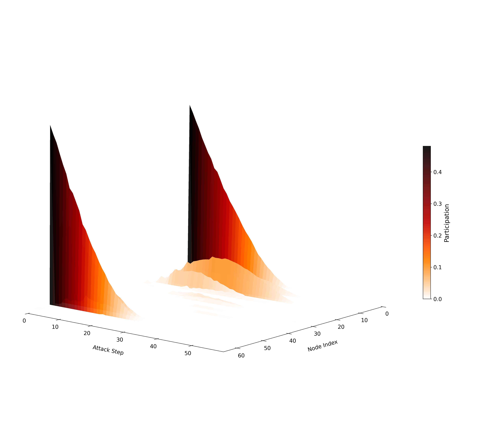
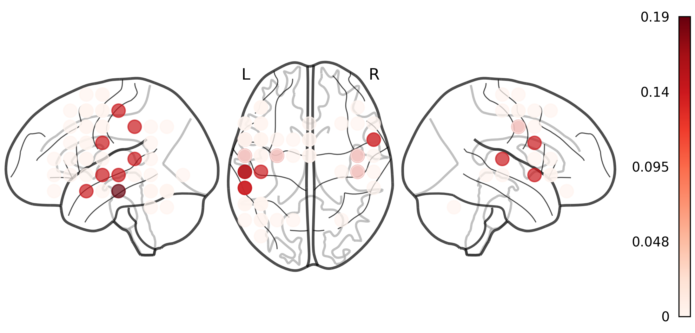

# Participation in Percolation (PiP): A Data-Driven Measure of Network Hubs in Functional Brain Networks

**Brady J. Williamson1**, Minarose Ismail2,3, Darren S Kadis2,3

1University of Cincinnati College of Medicine, Department of Radiology, Cincinnati, OH, USA  
2Neurosciences and Mental Health, Hospital for Sick Children, Toronto, ON, Canada  
3Department of Physiology, University of Toronto, Toronto, ON, Canada

## **Overview**  
PiP (Participation in Percolation) is a toolbox for identifying network hubs using a data-driven approach based on probabilistically sampled node attacks and percolation-based collapse analysis.

To validate the method and demonstrate its biological relevance, we apply PiP to magnetoencephalography (MEG) data collected during an expressive language task in a pediatric cohort, localizing functionally relevant language network hubs.

This repository accompanies the study:

> **"Participation in Percolation: 
A Data-Driven Measure of Network Hubs in Functional Brain Networks"**  
> *Williamson et al., 202x*

## Analysis Pipeline

To run the full pipeline on included data:

1. **Run the attack simulation**  
   `scripts/1_PiP_attack.m`  
   → Input: binary adjacency matrices (`data/adjacency_matrices/`)  
   → Output: node participation matrices (`results/`)

2. **Visualize node participation surfaces**  
   `scripts/2_viz_attack_surf.ipynb`  
   → Input: node participation matrices in `results/`  
   → Output: subject-level PiP surface plots
   **Example Output:**  

---

3. **Perform consensus clustering to identify critical hubs**  
   `3_consensus_clustering.ipynb`  
   → Input: node participation matrices in `results/`  
   → Output: critical node consensus map and group-level results (`figures/PiP_group_consensus/`)

   **Example Output:**  

---

4. **Compute graph-theory hub metrics**  
   `4_compute_hub_metrics.m`  
   → Input: Binary adjacency matrices (`data/adjacency_matrices/`) 
   → Output: Degree, betweenness, and PageRank metrics (`results/graph_hub_metrics/`)

---
5. **Compare PiP results with classical hub metrics**  
   `5_compare_metrics_consensus.py`  
   → Input: PiP and graph-theory hub matrices  
   → Output: Jaccard comparisons + consensus clustering figures\(`figures/PiP_group_consensus/`)  

---

 
